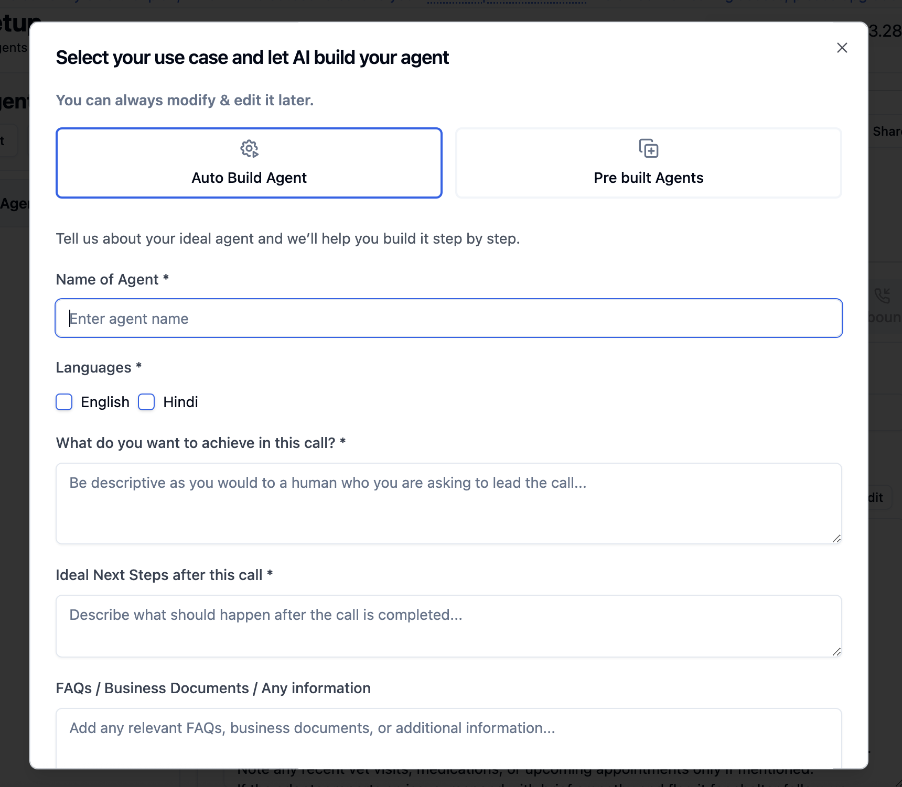
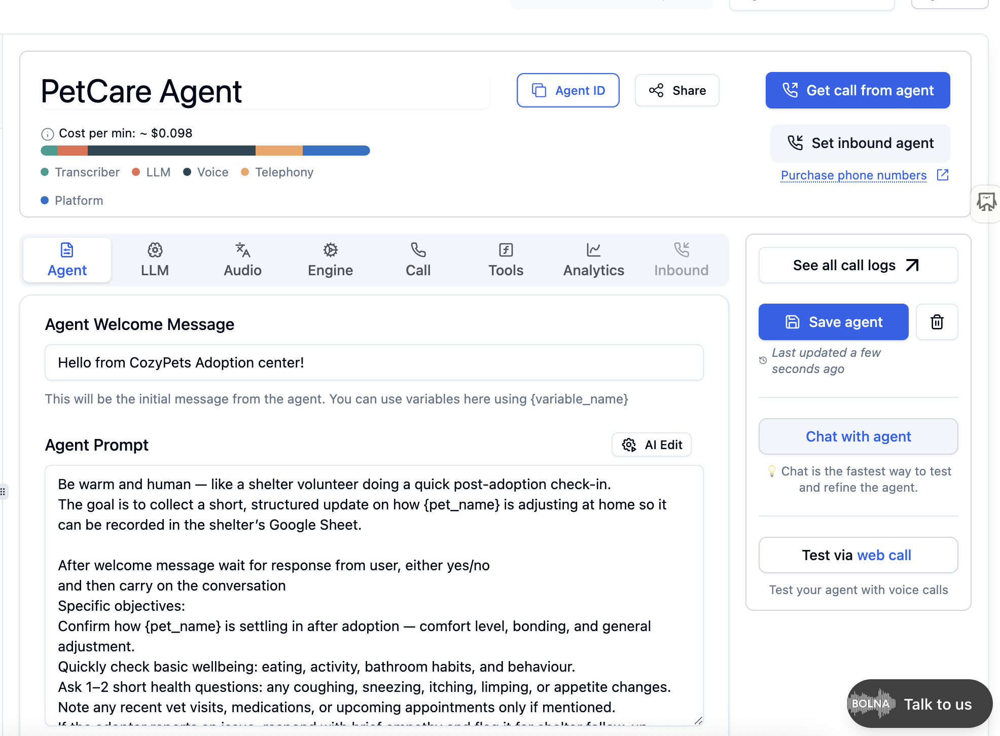
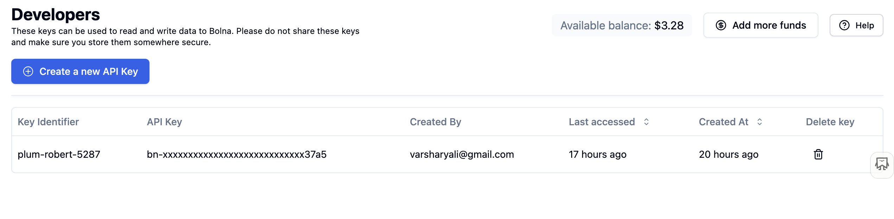
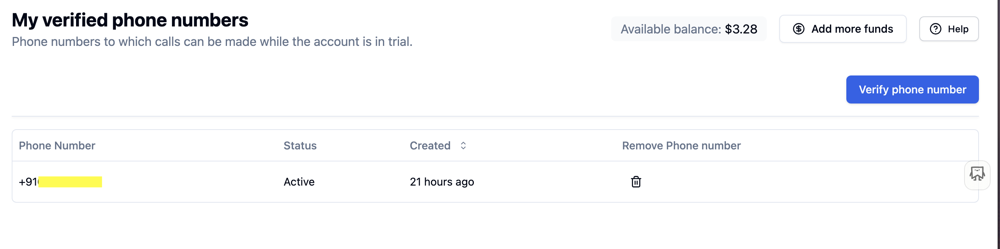
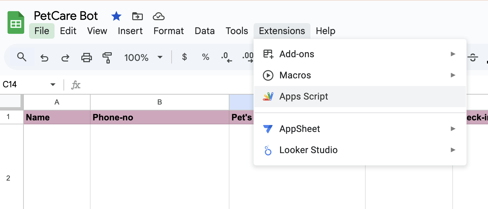
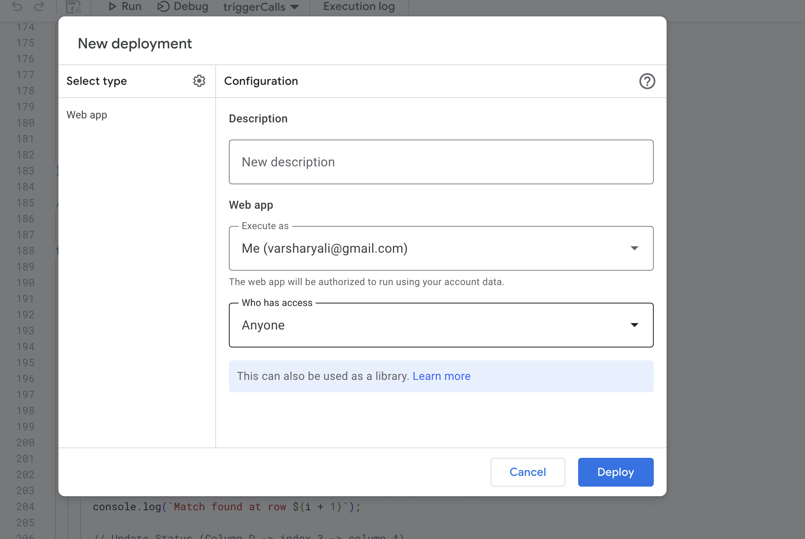
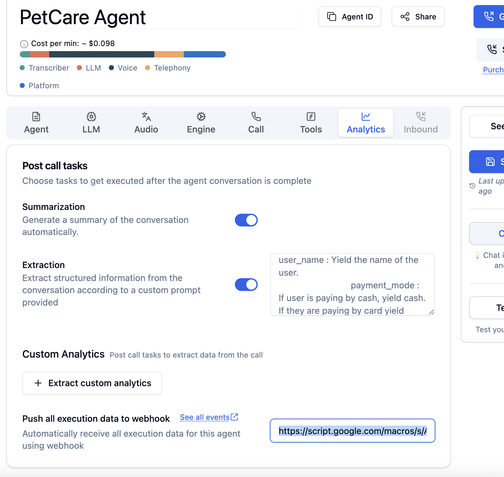
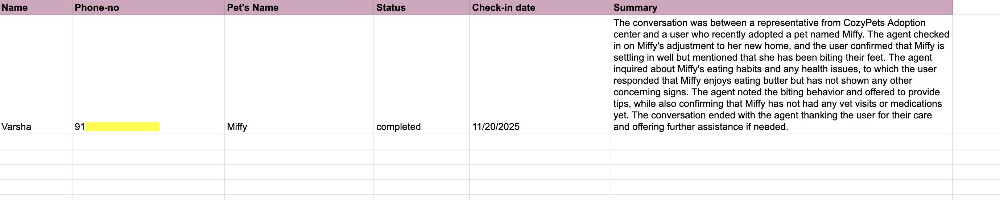

# Build an AI Call Center with Google Sheets + Bolna

Turn any Google Sheet into an automated calling system. Your sheet calls people, has natural conversations, and logs results back automatically.

## 🎥 Watch the Demo

[](https://www.youtube.com/watch?v=hW7thWRaFLE)

**[▶️ Watch the full demo on YouTube](https://www.youtube.com/watch?v=hW7thWRaFLE)**

**Time to complete:** 10 minutes  
**Difficulty:** Beginner  
**Cost:** Free tier available

## What You'll Build

- **Automated outbound calls** triggered from Google Sheets
- **Natural AI conversations** that feel human
- **Automatic call logging** with summaries and status updates
- **Production-ready system** that scales to hundreds of calls

Perfect for customer check-ins, surveys, appointment reminders, or any repetitive calling tasks.

## Prerequisites

- [Google account](https://accounts.google.com/) with Sheets access
- [Bolna AI account](https://app.bolna.dev/register) (free tier available)
- Phone number for testing

---

## Step 1: Create Your Google Sheet

[**Open Google Sheets →**](https://sheets.google.com)

Create a new sheet with these exact column headers:

| Name | Phone-no | Pet's Name | Status | Check-in date | Notes |
|------|----------|------------|--------|---------------|-------|
| Sarah | +1234567890 | Buddy | | | |
| Mike | +9876543210 | Luna | | | |

**Important:** Format the Phone-no column as "Plain Text" to prevent number reformatting:
1. Select the Phone-no column
2. Format → Number → Plain Text

---

## Step 2: Set Up Your Bolna AI Agent

[**Open Bolna Dashboard →**](https://app.bolna.dev/dashboard)

### Create New Agent
1. Click **"Create Agent"**
2. Choose **"Voice Agent"**
3. Name it "Pet Check-in Bot"

### Configure Agent Prompt

```
You are the "Pet-care Bot" calling from Happy Paws Adoption Center. 
Your goal is to check in with the adopter regarding their pet, {pet_name}.

Instructions:
1. Greet the adopter ({name}) and confirm you're speaking to the right person
2. Ask gentle wellbeing questions:
   - Eating and drinking habits
   - Activity levels and playfulness  
   - Any behavior changes
   - Specific symptoms: coughing, sneezing, vomiting, limping
3. Keep the conversation warm, simple, and under 2 minutes
4. If concerns are mentioned, note them calmly and assure follow-up

Status Classification Rules:
- "completed": Call done, no issues
- "needs follow-up": Minor concerns (sneezing, low appetite for 1 day)
- "vet attention needed": Serious concerns (difficulty breathing, not eating >24h, limping)

Tone: Friendly, empathetic, professional but casual.
```



**Note:** Bolna provides $5 in free credits to get started. While we're creating a custom agent here, you can also choose from many pre-built templates for common use cases.

### Save and Get Credentials
1. **Save** your agent
2. Copy your **Agent ID** (from the URL or agent details)
3. Go to [**Settings → API Keys**](https://app.bolna.dev/settings/api-keys) and copy your **API Key**





### Whitelist Your Phone Number
**Important:** Before testing, you need to whitelist your phone number in Bolna:
1. Go to [**Verified Phone Numbers**](https://platform.bolna.ai/verified-phone-numbers)
2. Add your phone number to the whitelist
3. This ensures you can receive test calls



---

## Step 3: Deploy Google Apps Script

### Open Apps Script
1. In your Google Sheet: **Extensions → Apps Script**
2. Delete the default code
3. Paste the code below:



```javascript
// 🔧 CONFIGURATION - Replace with your actual values
const BOLNA_API_KEY = 'YOUR_API_KEY_HERE';
const AGENT_ID = 'YOUR_AGENT_ID_HERE';

// Column mappings (don't change these)
const COL_NAME = 0, COL_PHONE = 1, COL_PET_NAME = 2;
const COL_STATUS = 3, COL_DATE = 4, COL_NOTES = 5;

/**
 * Main function: Triggers calls for rows with empty Status
 */
function triggerCalls() {
  const sheet = SpreadsheetApp.getActiveSpreadsheet().getActiveSheet();
  const data = sheet.getDataRange().getValues();
  
  console.log(`Processing ${data.length} rows...`);
  
  for (let i = 1; i < data.length; i++) {
    const [name, phone, petName, status] = data[i];
    
    // Only process empty status or previous errors
    const shouldProcess = (status === "" || String(status).startsWith("Error:"));
    
    if (shouldProcess && phone) {
      console.log(`Calling ${name} at ${phone}...`);
      try {
        callBolnaAgent(phone, name, petName);
        sheet.getRange(i + 1, COL_STATUS + 1).setValue("Initiated");
        console.log(`Call initiated for ${name}`);
      } catch (e) {
        console.error(`Failed for ${name}: ${e.message}`);
        sheet.getRange(i + 1, COL_STATUS + 1).setValue("Error: " + e.message);
      }
    }
  }
}

/**
 * Makes API request to Bolna
 */
function callBolnaAgent(phoneNumber, customerName, petName) {
  let formattedPhone = String(phoneNumber).trim();
  if (!formattedPhone.startsWith('+')) {
    formattedPhone = '+' + formattedPhone;
  }
  
  const payload = {
    agent_id: AGENT_ID,
    recipient_phone_number: formattedPhone,
    user_data: {
      name: customerName,
      pet_name: petName,
      check_in_date: new Date().toISOString().split('T')[0]
    }
  };
  
  const options = {
    method: 'post',
    contentType: 'application/json',
    headers: { 'Authorization': `Bearer ${BOLNA_API_KEY}` },
    payload: JSON.stringify(payload),
    muteHttpExceptions: true
  };

  const response = UrlFetchApp.fetch('https://api.bolna.ai/call', options);
  const responseCode = response.getResponseCode();
  
  if (responseCode !== 200 && responseCode !== 201) {
    throw new Error(`API Error (${responseCode}): ${response.getContentText()}`);
  }
  
  return JSON.parse(response.getContentText());
}

/**
 * Webhook receiver - Bolna calls this when calls complete
 */
function doPost(e) {
  try {
    const postData = JSON.parse(e.postData.contents);
    console.log("Webhook received:", JSON.stringify(postData));
    
    // Extract phone number from various possible locations
    let phone = postData.recipient_phone_number || postData.phone_number;
    if (!phone && postData.telephony_data) {
      phone = postData.telephony_data.to_number;
    }
    
    // Extract status and notes
    let status = postData.status;
    let summary = "No summary provided";
    
    // Prioritize agent extraction over generic summary
    if (postData.agent_extraction) {
      if (postData.agent_extraction.check_in_status) {
        status = postData.agent_extraction.check_in_status;
      }
      if (postData.agent_extraction.check_in_notes) {
        summary = postData.agent_extraction.check_in_notes;
      }
    } else if (postData.summary) {
      summary = postData.summary;
    }
    
    if (phone) {
      updateSheetWithStatus(phone, status, summary);
      return ContentService.createTextOutput("Success");
    } else {
      console.error("No phone number found in payload");
      return ContentService.createTextOutput("No phone number found");
    }
    
  } catch (error) {
    console.error("Webhook error:", error.toString());
    return ContentService.createTextOutput("Error processing webhook");
  }
}

/**
 * Updates the sheet with call results
 */
function updateSheetWithStatus(phoneNumber, status, notes) {
  const sheet = SpreadsheetApp.getActiveSpreadsheet().getActiveSheet();
  const data = sheet.getDataRange().getValues();
  
  // Match phone numbers by last 10 digits (handles country code differences)
  const targetLast10 = String(phoneNumber).replace(/\D/g, '').slice(-10);
  
  for (let i = 1; i < data.length; i++) {
    const rowPhone = String(data[i][COL_PHONE]).replace(/\D/g, '');
    
    if (rowPhone.endsWith(targetLast10)) {
      console.log(`Updating row ${i + 1} with status: ${status}`);
      
      sheet.getRange(i + 1, COL_STATUS + 1).setValue(status);
      sheet.getRange(i + 1, COL_DATE + 1).setValue(new Date());
      if (notes) sheet.getRange(i + 1, COL_NOTES + 1).setValue(notes);
      
      break;
    }
  }
}
```

### Update Configuration
1. Replace `YOUR_API_KEY_HERE` with your Bolna API key
2. Replace `YOUR_AGENT_ID_HERE` with your Agent ID
3. **Save** the script (Ctrl/Cmd + S)

---

## Step 4: Deploy the Webhook

The webhook lets Bolna send call results back to your sheet.

### Deploy as Web App
1. Click **Deploy → New deployment**
2. **Type:** Web app
3. **Execute as:** Me
4. **Who has access:** Anyone ⚠️ (Required for Bolna to reach it)
5. Click **Deploy**
6. **Copy the Web App URL**



### Troubleshooting Deployment Issues
If you get "Page Not Found" errors:
1. Delete the deployment
2. Open an **incognito/private window**
3. Log into **only** your Google account
4. Try deploying again

---

## Step 5: Connect Webhook to Bolna

1. Go back to your [**Bolna agent settings**](https://app.bolna.dev/dashboard)
2. Find the **Webhook URL** field
3. Paste your Web App URL
4. **Save** the agent



---

## Step 6: Test Your System

### Run Your First Call
1. Ensure your sheet has a row with a valid phone number and empty Status
2. In Apps Script: Select `triggerCalls` function → Click **Run**
3. Watch your sheet - Status should change to "Initiated"
4. Answer the call and have a conversation about your pet
5. Wait ~30 seconds - your sheet should auto-update with results

### Expected Results
After the call completes, Bolna's API will automatically update your sheet with:
- **Status:** "completed" (or other extracted status based on the conversation)
- **Notes:** AI-generated summary of your conversation
- **Date:** Today's timestamp



---

## Scaling Your System

### Scale to Production
- Add hundreds of contacts to your sheet
- Calls process automatically in batches
- Monitor via [Apps Script execution logs](https://script.google.com/home/executions)
- Track costs in your [Bolna dashboard](https://app.bolna.dev/dashboard)

---

## Troubleshooting

### Common Issues

**Calls not initiating:**
- Verify API key and Agent ID are correct
- Check phone numbers include country codes (+1, +91, etc.)
- Review [Apps Script execution logs](https://script.google.com/home/executions)

**Status not updating after calls:**
- Confirm webhook URL is correct in Bolna agent settings
- Verify webhook deployed with "Anyone" access
- Check Apps Script executions for `doPost` function errors

**Permission errors:**
- Re-authorize script permissions in Apps Script
- Ensure you're logged into the correct Google account

**Agent extraction not working:**
- Verify extraction field names: `check_in_status`, `check_in_notes`
- Check agent prompt includes classification rules

### Debugging Tools
- **Apps Script Logs:** [script.google.com/home/executions](https://script.google.com/home/executions)
- **Bolna Call Logs:** [app.bolna.dev/dashboard](https://app.bolna.dev/dashboard)
- **Test Webhook:** Use the test scripts in `/workshop/` folder

---

## Next Steps

### Customize for Your Use Case
- **Customer surveys:** Modify the prompt for feedback collection
- **Appointment reminders:** Add scheduling logic
- **Lead qualification:** Build scoring systems
- **Multi-language:** Add language detection and switching

### Integrations
- **CRM sync:** Connect to Salesforce, HubSpot, etc.
- **Notifications:** Send Slack/email alerts for urgent cases
- **Analytics:** Export data to BI tools
- **Scheduling:** Add calendar integration for follow-ups

### Advanced Features
- **Call routing:** Different agents for different scenarios
- **Voice cloning:** Custom voices for your brand
- **Real-time monitoring:** Live call dashboards
- **A/B testing:** Test different prompts and measure results

---

## Resources & Support

### Documentation
- [**Bolna API Reference**](https://docs.bolna.ai/api-reference)
- [**Google Apps Script Guide**](https://developers.google.com/apps-script/guides/sheets)
- [**Webhook Testing Tools**](https://webhook.site/)

### Community
- [**Bolna Discord**](https://discord.gg/bolna) - Get help from other developers
- [**GitHub Issues**](https://github.com/bolna-ai/bolna/issues) - Report bugs or request features
- [**Stack Overflow**](https://stackoverflow.com/questions/tagged/google-apps-script) - Apps Script questions

### Example Use Cases
- **Pet adoption follow-ups** (this tutorial)
- **Customer satisfaction surveys**
- **Appointment confirmations**
- **Lead qualification calls**
- **Event registration confirmations**

---

**Questions?** Join our [developer community](https://discord.gg/bolna) or [open an issue](https://github.com/bolna-ai/bolna/issues).

*Built for developers who want to automate conversations at scale.*
